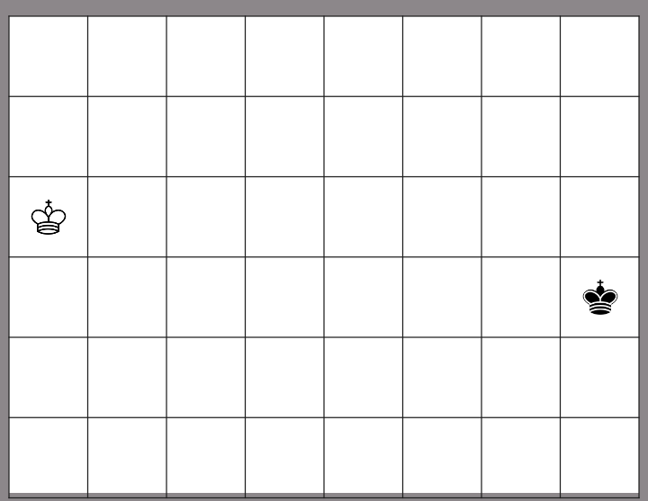

# Két Király táblajáték 

Egy olyan 6 x 8 mezőből álló játéktábla, amelyre az egyik
játékosnak egy világos, a másiknak egy sötét király sakkfigurát helyeztünk.
A játékosok felváltva lépnek. Egy lépésben a figurát valamelyik
nyolcszomszédos üres mezőre kell elmozdítani, 
majd pedig a mező eltűnik és oda többet nem lehet lépni sem.
Az a játékos nyer, aki utoljára tud még lépni.

A játék JavaFX alapú Modell Nézet Controller (MVC) architektúrájú.